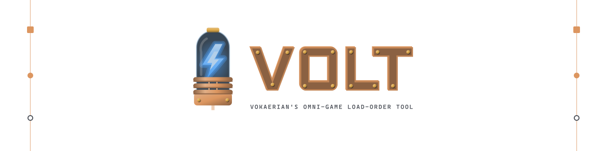

<picture>
  <source media="(prefers-color-scheme: dark)" srcset="docs/brand/banner-dark.svg">
  
</picture>

  
  
  
  

## What VOLT is

**VOLT** (Vokaerian's Omni-game Load-order Tool) is a mod manager and troubleshooter for a variety of games, built around one idea: one app, one familiar way to manage load orders, whichever game you play.

| Game | Status |
| --- | --- |
| RimWorld | Available |
| Valheim | Available |
| Lethal Company, R.E.P.O. | Planned (Thunderstore) |
| Project Zomboid, Slay the Spire 2, Palworld | Planned |

Python and PySide6, packaged with Nuitka as an unpacked Windows folder: no installer, just unzip and run.

## Download

Grab the latest build from the [Releases](https://github.com/Vokaerian/V.O.L.T/releases/latest) page.

## Credits

Design, scope and testing by [@Vokaerian](https://github.com/Vokaerian).
Code and implementation by [Claude](https://claude.ai) (Anthropic).

## License

VOLT's source code is released under the [MIT License](LICENSE). The licence covers the code only. It does not cover the VOLT logo, lettering and other artwork in `docs/brand/` (all rights reserved), the game cover art and names shown in the app (they belong to their respective owners), or bundled third-party components such as PySide6 (LGPL) and Valve's Steamworks redistributable library, which keep their own licences — see [THIRD_PARTY_NOTICES.md](THIRD_PARTY_NOTICES.md) (shipped in every release folder, with the LGPL/GPL texts in `licenses/`).
